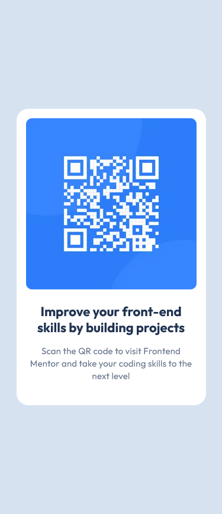
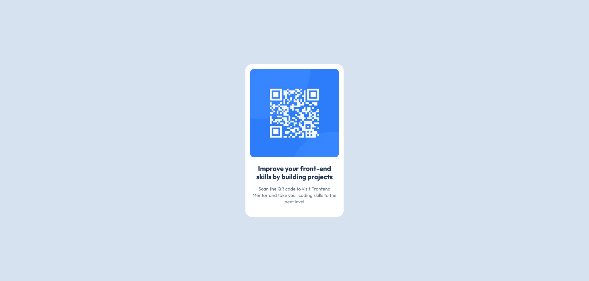

# QR Code Component

This project is a frontend challenge built with Next.js, TypeScript, and Sass, focusing on creating a responsive QR code component. It demonstrates how to implement a clean design and functionality, allowing users to scan the QR code and be redirected to a link. The project highlights the use of modern web technologies for creating interactive and accessible UI components.

For more details, visit [Frontend Mentor](https://www.frontendmentor.io/challenges/qr-code-component-iux_sIO_H)

## Table of contents

- [Overview](#overview)
  - [The challenge](#the-challenge)
  - [Screenshot](#screenshot)
  - [Links](#links)
- [My process](#my-process)
  - [Built with](#built-with)
  - [Installation Steps](#installation-steps)
  - [Useful resources](#useful-resources)
- [Author](#author)

## Overview

### The challenge

The goal of this project was to build a QR code component using Next.js, TypeScript, and Sass. The challenge focused on creating a visually appealing, responsive, and functional component that allows users to scan the QR code and access a specified link. Key objectives included adhering to modern web development practices and ensuring that the component was both accessible and user-friendly across different devices and screen sizes.

### Screenshot

- Phone Device (375px)
  

- Desktop Device (1440px)
  

_If the images are not visible, please check the file path or ensure the screenshots exists._

### Links

- [Live Site](https://qr-code-component-navy-chi.vercel.app/) - View the live version of the QR Code Component.

## My process

### Built with

- Mobile-first workflow
- [Sass](https://nextjs.org/docs/app/building-your-application/styling/sass) - Sass for styling
- [React](https://reactjs.org/) - TS library
- [Next.js](https://nextjs.org/) - React framework

### Installation Steps

#### 1. Clone the repository (if you haven't already)

    git clone git@github.com:nmelissarp/qr-code-component.git

#### 2. Navigate to the project folder

    cd qr-code-component

#### 3. Install dependencies

    npm install

#### 4. Run the development server

    npm run dev

#### 5. Verify the application Open your browser and navigate to http://localhost:3000 to ensure everything is working as expected.

### Useful resources

- [Next.js Documentation: Installation](https://nextjs.org/docs/app/getting-started/installation) - This resource provides a detailed guide on how to set up Next.js in your development environment, covering installation and configuration to get your project started.

- [Next.js Sass Styling Guide](https://nextjs.org/docs/app/building-your-application/styling/sass) - This guide explains how to integrate Sass into a Next.js project for styling, offering a streamlined approach to using advanced CSS techniques like variables and mixins.

## Author

- [Melissa Ramírez](https://www.linkedin.com/in/nmelissarp/) - Developer and enthusiast of web development, always learning and experimenting with new technologies.
